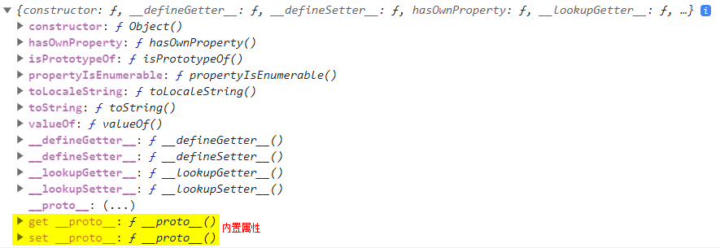

# 对象

## 对象的类型

函数是对象的一个子类型，函数在 JS 中是一等公民，它们本质上和普通对象一样（只是可以调用）。

数组也是对象的一种类型，具备一些额外的行为。

### 内置对象

String、Number、Boolean、Object、Function、Array、Date、RegExp、Error 这些也是对象的子类型。  
其本质上也是函数，可以当作构造函数来使用，从而可以构造一个对应子类型的新对象。

```js
Object.prototype.toString.call(String); // [object Function]
Object.prototype.toString.call(Number); // [object Function]
Object.prototype.toString.call(Boolean); // [object Function]
Object.prototype.toString.call(Object); // [object Function]
Object.prototype.toString.call(Function); // [object Function]
Object.prototype.toString.call(Array); // [object Function]
Object.prototype.toString.call(Date); // [object Function]
Object.prototype.toString.call(RegExp); // [object Function]
Object.prototype.toString.call(Error); // [object Function]
```

null 和 undefined 没有对应的构造形式，它们只有文字形式。  
Date 只有构造，没有文字形式。  
Object、Array、Function、RegExp 无论使用文字形式还是构造形式，它们都是对象，不是字面量。

## Object 的属性

通过`Reflect.ownKeys(Object)`获取 Object 的属性有 25 个，这些属性都是不可枚举属性。

```js
[
  'assign', // const obj = Object.assign({}, fun, fun1)，浅拷贝fun, fun1的属性到obj
  'create', // const obj = Object.create(fun.prototype)，创建一个新的对象obj，并把它与fun.prototype关联
  'defineProperties', // Object.defineProperties(obj, {
  //   property1: {
  //     value: 42,
  //     writable: true,
  //     enumerable: true
  //   },
  //   property2: {
  //     value: 'Hello',
  //     writable: false,
  //     enumerable: false
  //   }
  // });
  'defineProperty', // Object.defineProperty(obj, 'name', {value: xx, enumerable: true})， 添加/修改 name 属性的描述符
  'entries', // Object.entries(obj)，将对象obj转为[[key, value], [key, value], ...]的数组，适用于将对象转换为数组、遍历对象的键值对和获取对象的副本。
  'freeze', // Object.freeze(obj)，冻结obj，使其`configurable: false, writable: false`不能修改属性描述符，不能修改值，不能删除、添加属性
  'fromEntries', // Object.fromEntries(array)，将[[key, value], [key, value], ...]的数组转为对象，适用于将数组转换为对象和从另一个对象复制属性。
  'getOwnPropertyDescriptor', // Object.getOwnPropertyDescriptor(obj, 'name')，获取对象obj的属性name的描述符信息，只显示第一层级的属性
  'getOwnPropertyDescriptors', // Object.getOwnPropertyDescriptors(obj)，获取对象obj的所有属性的描述符信息，只显示第一层级的属性
  'getOwnPropertyNames', // Object.getOwnPropertyNames(obj)，获取对象obj的所有普通属性(也就是可枚举的属性)和不可枚举属性
  'getOwnPropertySymbols', // Object.getOwnPropertySymbols(obj)，获取对象obj的不可枚举属性和Symbol属性
  'getPrototypeOf', // Object.getPrototypeOf(obj)，获取对象obj的prototype，同obj.__proto__
  'hasOwn', // Object.hasOwn(obj, 'name')，判断obj对象是否有name属性，同obj.hasOwnProperty('name')，该方法是Object.prototype下的
  'is', // Object.is(val1, val2)，严格比较val1，val2是否相等，Object.is()的使用场景包括需要严格相等比较、比较NaN值以及区分-0和+0的情况。
  // 它考虑了特殊的值和边缘情况，可以在这些情况下提供更准确和可靠的比较结果。
  'isExtensible', // Object.isExtensible(obj)，判断obj是否可扩展添加新属性
  'isFrozen', // Object.isFrozen(obj)，判断obj是否被freeze
  'isSealed', // Object.isSealed(obj)，判断obj是否被sealed
  'keys', // Object.keys(obj)，获取对象obj的所有普通属性(也就是可枚举的属性)
  'length', // Object.length
  'name', // Object.name
  'preventExtensions', // Object.preventExtensions(obj)，阻止obj对象进行扩展，使其不能添加新属性，其他操作都可以，比如删除属性，修改属性值，修改属性描述符
  'prototype', // Object.prototype
  'seal', // Object.seal(obj)，封闭obj对象，使其`configurable: false`，不能添加、删除属性，以及修改属性描述符
  'setPrototypeOf', // Object.setPrototypeOf(obj, newPrototype)，修改obj的prototype为newPrototype
  'values', // Object.values(obj)，输出所有可枚举属性的value
];
```


### Object.prototype 的属性

通过`Reflect.ownKeys(Object.prototype)`获取 Object 的属性有 12 个，这些属性都是不可枚举属性。

```js
[
  'constructor', // 指向Object
  'hasOwnProperty', // obj.hasOwnProperty('name')，obj 对象是否有name属性
  'isPrototypeOf', // Foo.prototype.isPrototypeOf(a)，在a的整条[[prototype]]链中是否出现过Foo.prototype
  'propertyIsEnumerable', // obj.propertyIsEnumerable('a')，obj的属性a是否是可枚举的
  'toLocaleString', // 适合用于需要考虑地区设置并进行本地化的字符串表示，例如日期和数字的显示
  'toString', // 常用于获取对象的类型信息，或者获取内置对象的默认字符串表示形式。
  'valueOf', // 输出对象的值
  '__defineGetter__',
  '__defineSetter__',
  '__lookupGetter__',
  '__lookupSetter__',
  '__proto__', // 指向内置属性[[prototype]]
];
```

几乎所有的对象在创建的时候都会有一个非空的内置属性[\[prototype]]，普通的[\[prototype]]链最终都指向 Object.prototype，因此 Object.prototype 里的相关方法都可以调用。



## 对象的方法

1. 对象的复制，`Object.assign(targetObj, originObj)` 该复制是**浅拷贝**，它会遍历一个或多个源对象的所有**可枚举**的**自有键**并把它们复制(使用=操作符赋值)到目标对象，最后返回目标对象。
2. 判断当前对象上是否存在某个属性(不包括原型链)，`myObj.hasOwnProperty('a')`，如果一个对象(Object.create(null))没有链接到 Object.prototype 上，就会失败，另一个更健壮的方法`Object.prototype.hasOwnProperty.call(myObj, 'a')`;
3. 判断对象是否存在某个属性(包括原型链)，`'a' in myObj`，**in 操作符会遍历整个原型链查找，不论属性是否可枚举**；
4. 某个属性是否可枚举， `myObj.propertyIsEnumerable('a')`、`Object.prototype.propertyIsEnumerable.call(myObj, 'a')`
5. 获取对象的所有普通属性 key，`Object.keys(myObj)`、for... in 获取所有可枚举的普通属性和原型属性；
6. 获取对象的所有值，`Object.values(myObj)`、for...of 获取所有内置或者自定义的@@iterator 对象并调用它的 next()方法来遍历数据值。
7. 把对象的属性和值以键值对的形式组成新的数组，`Object.entries(myObject)`
8. `const B = Object.create(A)`，创建一个对象 B，并把这个对象的[\[prototype]]关联到指定的对象 A；当 A 为 null 时，会生成一个空对象，该对象没有[\[prototype]]这个内置属性，它比直接赋值一个 {} 还空，因为字面量的 {} 默认是有内置对象[\[prototype]]的。

## “类”函数

### 函数的属性

通过`Reflect.ownKeys(Fun)`获取 Fun 的属性有 5 个，这些属性都是不可枚举属性。

```js
['length', 'name', 'arguments', 'caller', 'prototype'];
```

通过`Reflect.ownKeys(FunName.prototype)`获取 Fun.prototype 的属性默认有 1 个，这个属性是不可枚举属性。手动通过`Fun.prototype.xxx = function(){}`添加的 xxx 属性是普通可枚举的属性。

```js
[
  'constructor', // 该属性指向函数Fun本身
];
```

所有函数默认都会拥有一个名为 prototype 的共有并且不可枚举的属性，它会指向另一个对象。

Fun.prototype 默认也有一个公有且不可枚举的属性.constructor，这个属性引用的是对象关联的函数。

通过 new Fun()创建的每个对象都会被[\[prototype]]链接到这个“Foo.prototype”对象。

### 使用 new 操作符构造函数调用

所谓的构造函数和普通函数没有区别，当在普通函数调用前面加上 new 关键字之后，就会把这个函数调用变成一个“构造函数调用”。也就是说，new 会劫持所有普通函数并用构造对象的形式来调用它。

使用 new 操作符来调用函数 Fun(构造函数调用)，会自动执行以下过程：

1. 创建一个全新的对象；
2. 这个对象会被执行[\[prototype]]链接到所调用函数的 Fun.prototype;
3. 这个新对象会绑定到函数调用的 this；
4. 如果函数没有返回其他对象，那么所调用函数 Fun 会自动返回这个新对象。

> new Fun() 这个构造函数调用实际上并没有**直接创建**关联，这个关联只是一个意外的副作用。new Fun() 只是间接完成了我们的目标：一个关联到其他对象的行对象。
> 直接关联一个其他对象，可以使用`var newObj = Object.create(obj)`。

## 对象隐式转换规则

1. 如果[Symbol.toPrimitive]\(hint)方法存在，优先调用，无视 obj.valueOf()和 obj.toString()方法;
2. 条件一不成立的话，如果转换结果期望是 string 类型，则先调用 obj.toString()，如果返回的结果不是原始值，继续调用 obj.valueOf()
3. 条件一不成立的话，如果转换结果期望是 number 或 default，则先调用 obj.valueOf()，如果返回结果不是原始值，继续调用 obj.toString()

## JSON

JSON 广义上讲，是一种文本协议，狭义来说，在全局环境下，是 Object 的一个对象。

JSON 的特征：就是一串字符串，使用特定的符号标注。{}表示对象，[]表示数组，双引号内是属性键或值。

JSON 键：1、只能是字符串，2、必须双引号包裹

JSON 值范围：object、array、number、string、true、false、null。number 只能是十进制，最后一个属性不能有逗号。

### JSON.parse()

JSON.parse(objString, callback(key, value)?)，第二个参数是可选的函数，可用于过滤转换后的 json 属性。

```js
var objStr = `
    {
        "name": "jeff",
        "age": 18,
        "isFans": true,
        "IDCard": "xxxxx"
    }
`;
var obj = JSON.parse(objStr, function (key, value) {
  if (key === 'IDCard') {
    return undefined;
  } else {
    return value;
  }
});
console.log(obj);
```

JSON.parse 的解析顺序是有子属性的话先遍历子属性，然后在回过来遍历父属性。

```js
var jsonStr = `{
    "name": "jeff",
    "age": 23,
    "address": {
        "line1": "tai bai nan lu",
        "line2": "20hao"
    }
}`;
JSON.parse(jsonStr, function (key, val) {
  console.log('key = ', key, ', this: ', this);
  return val;
});
/** 结果如下
 *  key = name , this:  {
        name: 'jeff',
        age: 23,
        address: { line1: 'tai bai nan lu', line2: '20hao' }
    }
    key = age , this:  {
        name: 'jeff',
        age: 23,
        address: { line1: 'tai bai nan lu', line2: '20hao' }
    }
    key = line1 , this:  { line1: 'tai bai nan lu', line2: '20hao' }
    key = line2 , this:  { line1: 'tai bai nan lu', line2: '20hao' }
    key = address , this:  {
        name: 'jeff',
        age: 23,
        address: { line1: 'tai bai nan lu', line2: '20hao' }
    }
    key =  , this:  {
        '': {
            name: 'jeff',
            age: 23,
            address: { line1: 'tai bai nan lu', line2: '20hao' }
        }
    }
 */
```

### JSON.stringify()

JSON.stringify(value[, replacer [, space]])

第二个参数 replacer：过滤属性或处理值；

- 如果参数是一个函数，每个序列化的值都会经过该函数的转换和处理；
- 如果参数是一个数组，则表示包含在这个数组中的属性名才会被序列化到最终的 JSON 字符串中；
- 如果该参数为 null 或者未提供，则对象所有的属性都会被序列化；

第三个参数 space：美化输出格式；

- 如果参数是个数字，代表有多少个空格，上限为 10，小于 1 表示没有空格；
- 如果参数为字符串，该字符串被作为空格分割美化（字符串长度最多 10 位，超出截取前 10 位）；
- 如果该参数没有提供或为 null，将没有空格

特殊的规则：

1. undefined、任意的函数、symbol

   - 作为对象属性值，自动忽略；
   - 作为数组，序列化返回 null；
   - 单独作为值序列化时，返回 undefined；

2. Date 返回 ISO 字符串
3. 循环引用报错
4. NaN，Infinity，null 都会作为 null
5. BigInt 报错
6. Map/Set/WeakMap 等对象，仅序列化可枚举属性

### toJSON

如果对象拥有同 JSON 方法，同 JSON 会覆盖对象默认的序列化行为；

```js
var json = {
  name: 'jeff',
  age: 23,
  address: {
    line1: 'tai bai nan lu',
    line2: '20hao',
  },
  toJSON() {
    return { name: 'jeff' };
  },
};
JSON.stringify(json); // '{"name":"jeff"}'
```
